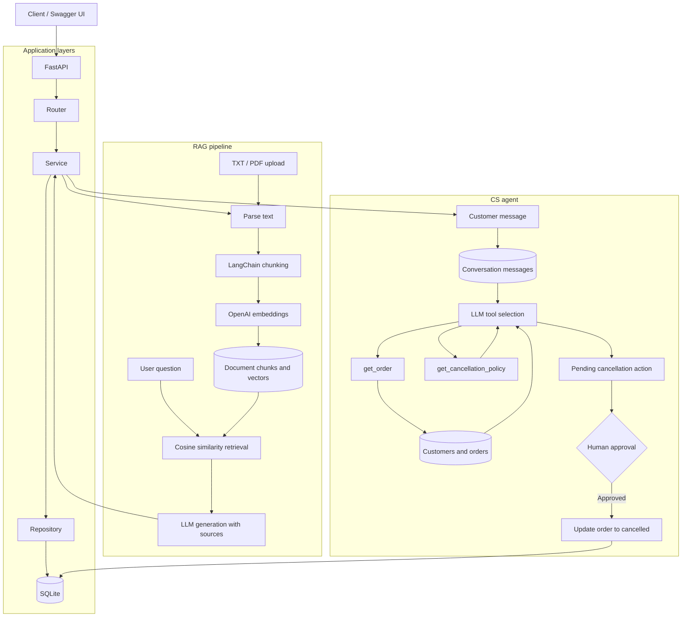

# ai-engineering-playground

Hands-on practice for backend, AI engineering, RAG, agents, observability, and CS fundamentals.

## Current features

- FastAPI and Swagger UI
- User CRUD with Router, Service, and Repository layers
- SQLAlchemy and Alembic migrations
- Document storage and LangChain text chunking
- OpenAI embeddings stored with document chunks
- Function Calling CS agent with conversation memory and approval-gated actions

## Architecture



## Run locally

```bash
python3 -m venv .venv
source .venv/bin/activate
pip install -r requirements.txt
cp .env.example .env
alembic upgrade head
uvicorn app.main:app --reload
```

Add your OpenAI API key to `.env` before using the embedding endpoint.

```dotenv
OPENAI_API_KEY=your-api-key
```

Open Swagger UI at <http://127.0.0.1:8000/docs>.

## Main endpoints

- `GET /health`
- `POST /chat`
- `GET`, `POST`, `PATCH`, `DELETE /users`
- `GET`, `POST /documents`
- `POST /documents/upload` (`.txt` or text-based `.pdf`, up to 10 MB)
- `POST /documents/search`
- `POST /documents/{document_id}/chunk-preview`
- `POST /documents/{document_id}/embed`
- `POST /rag-chat`
- `POST /cs-agent/chat`
- `POST /cs-agent/actions/{action_id}/approve`

Start a CS conversation without a `conversation_id`, then reuse the returned ID
in later requests so phrases such as `그 주문` can refer to previous messages.
Cancellation requests create a pending action; the order changes only after the
separate approval endpoint is called.

CS agent sample orders:

- `1001`: preparing (cancellable)
- `1002`: shipped
- `1003`: delivered
